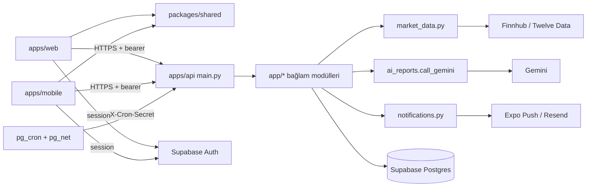
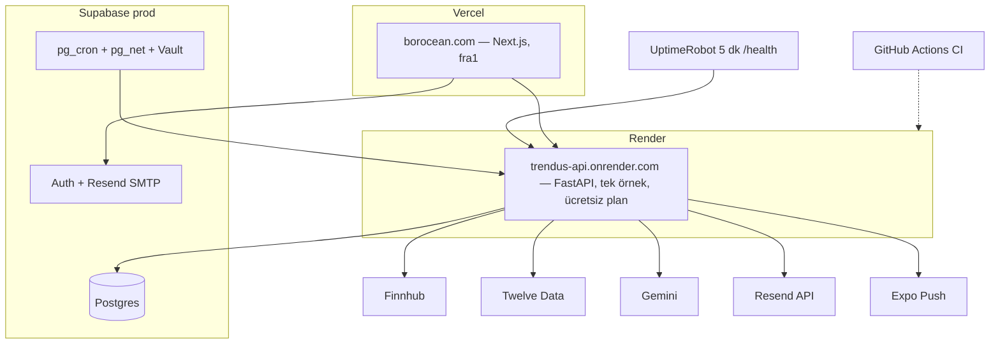

# Architecture Spine — Borocean

Bu spine, `docs/architecture.md` (2026-09-15) belgesinin yerini alır. O belge, kod yazılmadan önceki tasarımdı. Bu spine ise canlıdaki kodun gerçekte uyduğu kuralları kayda geçirir. AD-1…AD-9 numaraları korunmuştur.

## Design Paradigm

**Yönetilen platformlar üzerinde modüler monolit.** Tek bir FastAPI süreci çalışır. Kimlik doğrulama, veritabanı, zamanlayıcı, e-posta ve push için yönetilen servisler kullanılır. İstemciler yalnızca bu API ile ve Supabase Auth ile konuşur.

| Katman | Yer |
| --- | --- |
| İstemci (web) | `apps/web` — Next.js App Router. Sayfalar `src/app`; API istemcileri `src/lib/<özellik>-client.ts` |
| İstemci (mobil) | `apps/mobile` — Expo. Ekranlar `screens/`, yardımcılar `lib/` |
| Paylaşılan alan | `packages/shared` (`@borocean/shared`) — i18n, indikatörler, çizimler, tema token'ları, auth yardımcıları, hukuki metin sürümü, borsa listesi |
| API | `apps/api/app` — bağlam başına bir modül (`alerts.py`, `portfolios.py`…); tek yönlendirici `main.py` |
| Veri | Supabase Postgres + Auth + pg_cron/pg_net + Vault |



Bağımlılık yönü bir kuraldır: istemciler `packages/shared`'a bağlanabilir ama bunun tersi olamaz. API modülleri dış servislere yalnızca okun gösterdiği tek kapıdan ulaşır.

## Invariants & Rules

### AD-1 — Modüler monolit; yazma sahipliği modülde [ADOPTED]

- **Binds:** all
- **Prevents:** Bağlamların ayrı servislere bölünmesi; iki modülün aynı tabloya farklı kurallarla yazması.
- **Rule:** Backend tek bir FastAPI uygulamasıdır. Her bağlam `apps/api/app/<bağlam>.py` içinde yaşar. Bir tabloya yalnızca sahibi olan modül yazar (INSERT, UPDATE, DELETE). Başka bir modülün tablosunu okuyan SQL (join dahil) kabul edilir; arka plan işleri (`insights`, `alert_runner`) bu yolla okur. Bir okuma bir iş kuralı taşıyorsa (örneğin "bu sembolle kim ilgileniyor"), kural sahibi modülde bir fonksiyon olur ve iki taraf onu çağırır. HTTP rotaları yalnızca `main.py`'de tanımlanır.

### AD-2 — Paylaşılan TypeScript alanı ve elle aynalanan API şekilleri [ADOPTED]

- **Binds:** apps/web, apps/mobile, packages/shared
- **Prevents:** Web ve mobilin aynı çeviriyi, indikatörü veya kuralı iki farklı şekilde yazması; bir API yanıtının yalnızca bir istemcide güncellenmesi.
- **Rule:** İki istemcide ortak olan her mantık `@borocean/shared`'dadır: metinler, indikatör hesapları, tema, hukuki sürüm ve borsa listesi (AD-18). OpenAPI'den tip üretimi yoktur; `packages/shared`'daki `generate:types` betiği ve `openapi-typescript` bağımlılığı kullanılmıyor, kaldırılabilir. Bir yanıt şekli değiştiğinde web `src/lib/*-client.ts` ve mobil `lib/` istemcileri aynı değişiklikte güncellenir. Yanıt değişiklikleri **eklemeli** olmalıdır: alan eklenir, var olan alanın tipi veya adı değişmez. Bunun sebebi, API `main`'e push edilince kendiliğinden yayınlanırken web'in elle, mobilin ise mağaza yoluyla yayınlanmasıdır. Sayılar JSON'da sayı olarak kalır (`Decimal` string'e çevrilmez).

### AD-3 — Tek veri platformu: Supabase Postgres [ADOPTED]

- **Binds:** all
- **Prevents:** İkinci bir kalıcı depo; ortamlar arasında şema sapması; yeni koda dayanan şemanın prod'da olmaması; RLS'ye güvenip sahiplik kontrolünü atlamak.
- **Rule:** Kalıcı durum tek Supabase Postgres'te tutulur, prod ve dev ayrı projelerdir. Şema değişikliği `apps/api/migrations/NNNN_<ad>.sql` olarak yazılır, idempotenttir (`if not exists`) ve önce dev'e uygulanır. Ona dayanan kod `main`'e girmeden **önce** prod'a da uygulanır, çünkü Render push'ta kendiliğinden yayınlar. API `postgres` rolüyle bağlandığı için RLS'yi atlar. Bu yüzden her kullanıcı tablosunda RLS açıktır ama politika yoktur; bu, Data API açılırsa erişimi kapalı tutar. Sahiplik her sorguda `user_id` filtresiyle ya da sahibi `user_id` taşıyan bir üst satır üzerinden uygulama kodunda kontrol edilir.

### AD-4 — İstemciler yalnızca kendi API'mizle konuşur [ADOPTED — gerçek zamanlı ağ geçidi kaldırıldı]

- **Binds:** apps/web, apps/mobile
- **Prevents:** Sağlayıcı API anahtarlarının istemciye sızması; sağlayıcı değişince istemcilerin de değişmek zorunda kalması.
- **Rule:** İstemciler piyasa verisi, AI ve bildirim sağlayıcılarını doğrudan çağırmaz. Tek istisna Supabase Auth'tur. Gerçek zamanlı kanal (WebSocket/pub-sub) yoktur, veri istek anında alınır. Gerçek zamanlı akış eklenirse yeni bir AD gerekir.

### AD-5 — Piyasa verisi tek kapıdan, sağlayıcı başına tek bütçe [ADOPTED — bilinen sapmalar var]

- **Binds:** market_data, fundamentals, technical, screener, comparison, highlights, bulletins, alerts, portfolios, simulations, insights, epic-crypto-market
- **Prevents:** Sağlayıcıya özgü formatların diğer modüllere sızması; ücretsiz kotaların farklı yerlerden habersizce aşılıp sonuçların sessizce eksik dönmesi; bir kripto varlığın aynı sembollü bir ABD hissesi gibi fiyatlanması.
- **Rule:** Bir sağlayıcıya giden her HTTP çağrısı `app/market_data.py` üzerinden geçer. Bu modül normalize edilmiş tipler döndürür ve sağlayıcıyı `(symbol, exchange)` çiftine göre seçer. Tanınmayan bir borsa hata verir, ABD'ye düşmez. Her sağlayıcının süreç genelinde tek bir istek bütçesi vardır:
  - Finnhub için dakikada 60.
  - Twelve Data için dakikada 8 ve günde 800.
  - Kullanıcı istekleri korunan bir hattan, arka plan işleri kalan bütçeden harcar.
  - Bütçe aşılınca kullanıcıya açıklayıcı bir uyarı döner; sessiz boşluk olmaz.
  - Sağlayıcı verisi üzerinde tutulan her önbelleğin anahtarı `(symbol, exchange)`'dir.
  - BIST, `BIST_ENABLED` bayrağıyla kapalıdır.
- **Uygulama (15.2):** Finnhub çağrıları `market_data.finnhub_get` üzerinden yapılır. `FINNHUB_BUDGET` ve `TWELVEDATA_BUDGET` sağlayıcı bütçeleridir. Arka plan işleri `background_lane()` içinde çalışır. Fiyat önbelleği 60 saniye, profil önbelleği 24 saat tutulur; ikisinin de anahtarı `(symbol, exchange)`'dir.
- **Kalan sapmalar:** `alerts.py` BIST dışındaki her borsayı ABD fiyatıyla değerlendiriyor, ve run içi fiyat önbellekleri yalnızca `symbol` ile anahtarlanıyor. İkisini de ticket 11.1 kapatacak.

### AD-6 — Zaman serisi depolama [RETIRED 2026-10-09]

- **Binds:** — (emekli; numara yeniden kullanılmaz)
- **Prevents:** —
- **Rule:** Mumlar ne veritabanında ne bellekte önbelleklenir. Her grafik, sinyal, skor, karşılaştırma ve RSI filtresi sağlayıcıdan yeniden alınır ve Twelve Data bütçesini harcar. Bir önbellek eklenecekse AD-5'teki anahtar kuralı geçerlidir. Tetik ve karar Deferred bölümünde.

### AD-7 — Yetki kontrolü yalnızca sunucuda [ADOPTED]

- **Binds:** all gated features, epic-freemium-monetization
- **Prevents:** İstemcinin kendi katmanına karar vermesi; özellik sınırlarının web ve mobilde farklı olması.
- **Rule:** Katman ve sınırlar `entitlements` tablosundan ve `app/entitlements.py`'deki `enforce_*` fonksiyonlarından çözülür. İstemci yalnızca sunucunun döndürdüğü yetkiyi gösterir. `ALL_FEATURES_FREE = True` iken bütün kapılar açıktır. Ödeme sağlayıcısı (RevenueCat) Story 8.2 ile birlikte ertelendi.

### AD-8 — Zamanlanmış işler pg_cron + korumalı iç uç nokta [ADOPTED — Celery + Redis yerine]

- **Binds:** insight_runner, alert_runner ve gelecekteki tüm periyodik işler
- **Prevents:** Ayrı bir worker veya beat sürecine ihtiyaç duyulması (Render ücretsiz plan); aynı işin iki kez çalışıp çift bildirim göndermesi; bir varlık sınıfının başka bir piyasanın saatleriyle değerlendirilmesi.
- **Rule:** Periyodik bir iş, Supabase `pg_cron` + `pg_net` ile `POST /internal/<iş>/run` çağrısı olarak kurulur. Çağrı Vault'taki `insights_cron_secret`'ı `X-Cron-Secret` başlığında taşır. Bu sır Render'daki `CRON_SECRET` ile aynı olmalıdır; biri değişince ikisi birlikte değişir. Uç nokta sırrı `_check_cron_secret` ile doğrular, 202 döner ve işi süreç içinde bir `asyncio` görevi olarak başlatır. Bir iş `(bağlam, borsa grubu)` ile tanımlanır (örneğin `alerts:price:US`, ileride `alerts:price:CRYPTO`). Zamanlaması o borsa grubunun piyasa saatlerinden gelir. Aynı kimlikle yalnızca bir iş aynı anda çalışır ve iş idempotenttir. Zamanlama SQL'i `apps/api/scripts/setup_<iş>_cron.sql` dosyasında durur; `pg_net` zaman aşımı 60 saniyedir, Render'ın uyanma süresini karşılar.
- **Not:** Sektör bülteni zamanlanmış bir iş değil; sayfa açılınca üretilir. Ancak artık süreç içinde tek-uçuştur ve başarısızlık 10 dakika hatırlanır (15.6).

### AD-9 — Tek grafik motoru [ADOPTED]

- **Binds:** apps/web, apps/mobile grafikleri
- **Prevents:** İki platformda iki ayrı grafik uygulaması.
- **Rule:** Grafikler `lightweight-charts` ile çizilir: web'de doğrudan, mobilde `PriceChartWebView` içinde. İndikatör hesapları `@borocean/shared/indicators`'dan gelir.

### AD-10 — Kimlik, profil ve onay [ADOPTED — bilinen sapma var]

- **Binds:** all authenticated routes, auth flows, epic-domain-infrastructure (14.4, 14.5)
- **Prevents:** Kendi oturum veya profil tablosu yazılması; web ve mobilin kullanıcı adını ya da dili farklı yerden okuması; onay kaydı olmadan açılan hesap.
- **Rule:** Kimlik Supabase Auth'tur. API, `Authorization: Bearer` JWT'sini JWKS ile doğrular (`app/auth.py`) ve kullanıcı kimliği `sub` alanıdır. Web oturumu `@supabase/ssr` çerezlerinde tutar ve tarayıcı API'yi doğrudan bearer ile çağırır. Profil alanları `user_metadata`'dadır: `display_name`, `locale`, `legal_accepted_at` ve `legal_version`. Ad gösterimi her yerde `displayNameFrom()` ile yapılır. **Her kayıt yolu** (e-posta, Google, Apple; web ve mobil) kullanıcı Panele ulaşmadan önce `legal_accepted_at`, güncel `LEGAL_VERSION` ve `locale` alanlarını yazmış olur. Bir profil tablosu ancak yeni bir AD ile açılır.
- **Bilinen sapma:** OAuth geri dönüşü onay kaydetmiyor (CR D1). Google girişi (14.4) açılmadan önce kapatılmalı.

### AD-11 — Uyum kod içinde (SPK/KVKK) [ADOPTED]

- **Binds:** all user-facing output, AI, notifications, epic-crypto-market
- **Prevents:** Bir ekranın, AI çıktısının veya bildirimin al/sat/tut yönlendirmesi, hedef fiyat ya da getiri tahmini içermesi; bir prompt değişikliğinin ilgisiz raporları geçersiz kılması.
- **Rule:** Hiçbir çıktı yönlendirici etiket taşımaz (docs/compliance.md). Her Gemini çağrısı `ai_reports.call_gemini` üzerinden geçer ve `COMPLIANCE_RULES` içerir. Saklanan AI çıktısı bir sürüm numarası taşır; sürüm değişince yalnızca o ailenin çıktısı yeniden üretilir. Bugün tek sürüm `PROMPT_VERSION` (hisse raporları); yeni bir prompt ailesi (örneğin kripto, 11.7) kendi sürüm sabitini açar. Analiz gösteren her ekran ve her e-posta "yatırım tavsiyesi değildir" ibaresini taşır. Push metni kısa olduğu için ibare, push'un açtığı ekranda yer alır (kullanıcı onayı 2026-10-09).

### AD-12 — AI çıktısı saklanır, yeniden kullanılır; dil anahtarın parçasıdır [ADOPTED]

- **Binds:** ai_fundamental, ai_technical, ai_combined, bulletins, insights
- **Prevents:** Her sayfa açılışında Gemini çağrısı yapılması ve kotanın tükenmesi; iki dildeki çıktının birbirinin üstüne yazılması.
- **Rule:** AI çıktıları Postgres'te saklanır (`ai_reports`, `sector_bulletins`, `symbol_insights`). Aynı anahtar, sürüm ve gün için tekrar kullanılır. Arka plan işleri günlük üst sınırla çalışır. AI metni, kullanıcının arayüz dilinde üretilir (kullanıcı kararı 2026-10-09). `locale` önbellek anahtarının parçasıdır ve iki dil birbirinin üstüne yazmaz. Raporlar ve bülten bunu uyguluyor (15.11, migration `0014_ai_locale.sql`). Portföy gelişme notları henüz yalnızca Türkçe üretiliyor; bu bilinen sapma ve ticket 15.12 ile kapanacak. Kullanıcı isteğiyle üretilen yeni bir AI türü de saklanır; doğrudan ve önbelleksiz çağrı yasaktır. Gemini modeli `config.gemini_model`'de tek yerde tanımlıdır.

### AD-13 — Dil [ADOPTED]

- **Binds:** all user-facing text
- **Prevents:** Bileşene gömülü metinler; sunucunun gönderdiği metnin kullanıcının dilini yok sayması.
- **Rule:** İstemci metinleri `@borocean/shared` i18n'de, `tr` (varsayılan) ve `en` olarak tutulur. Sunucunun ürettiği metinler (e-posta, push, AI) dili `user_metadata.locale`'den alır, yoksa `tr` kullanılır.

### AD-14 — Bildirimler tek modülden, olay başına en fazla bir kez [ADOPTED]

- **Binds:** alerts, signal_alerts, insights, epic-crypto-market
- **Prevents:** Sayfa yüklemesi ve zamanlayıcı aynı anda çalıştığında çift bildirim gitmesi; kanalların farklı modüllerden çağrılması.
- **Rule:** Push (Expo) ve e-posta (Resend) yalnızca `app/notifications.py` üzerinden gönderilir. Kanal tercihleri `user_notification_settings` tablosundan okunur. Göndermeden önce olay **sahiplenilir** ve yalnızca sahiplenen çağrı gönderir. Sahiplenme iki yoldan biriyle yapılır: koşullu bir durum güncellemesi (`UPDATE … WHERE status = 'active'`) ya da benzersiz anahtarlı bir log satırı ekleme (`insight_push_log`). Yeni bir bildirim kaynağı bu iki yoldan birini kullanır.

### AD-15 — Hesap silme her şeyi siler [ADOPTED]

- **Binds:** every user-owned table
- **Prevents:** KVKK kapsamında hesap silindikten sonra kişisel verinin kalması.
- **Rule:** Kullanıcıya ait her tablo ya doğrudan `user_id uuid not null references auth.users(id) on delete cascade` tanımlar ya da böyle bir üst tabloya `on delete cascade` ile bağlanır (örneğin `positions` → `portfolios`). `DELETE /me` auth kullanıcısını sildiğinde bütün veri kaskadla silinir. Kaskad dışında kalan bir tablo `account.delete_account` içinde açıkça silinir.

### AD-16 — Web/mobil eşitliği [ADOPTED]

- **Binds:** all user-facing features
- **Prevents:** Bir özelliğin sessizce yalnızca bir platformda kalması.
- **Rule:** Her kullanıcı özelliği web ve mobilde birlikte çıkar. Yalnızca bir platformda kalacaksa, story'nin Notes bölümüne `Decision:` satırı yazılır.

### AD-17 — Async koddan veritabanına erişim [NEW — bilinen sapma var]

- **Binds:** apps/api (tüm endpoint'ler ve `*_runner.py`)
- **Prevents:** Senkron bir sorgunun olay döngüsünü bloke edip bir kullanıcının ya da sabah taramasının diğer tüm istekleri durdurması.
- **Rule:** Senkron `psycopg` çağrısı `async def` içinden doğrudan yapılmaz. DB kullanan bir endpoint ya `def` olur (FastAPI threadpool'da çalıştırır) ya da çağrıyı `asyncio.to_thread` ile sarar. Arka plan işleri de aynı kurala uyar. Bağlantı havuzu (`psycopg_pool`) ve Supavisor pooler adresi ertelendi; tetikleri Deferred bölümünde.
- **Uygulama (15.5):** Async kod DB'ye `asyncio.to_thread` ile erişir. Sipariş işlemi (`_execute_order`) tek bir thread içinde bir transaction olarak çalışır.

### AD-18 — Borsa listesinin tek sahibi [NEW]

- **Binds:** packages/shared, apps/api, migrations, epic-crypto-market
- **Prevents:** Yeni bir borsanın (`CRYPTO`) altı tablonun CHECK kısıtında, `main.py`'deki doğrulamalarda ve istemci tiplerinde ayrı ayrı ve tutarsız eklenmesi.
- **Rule:** Geçerli borsa kodları `packages/shared/src/exchanges.ts`'te ve aynı değerleri taşıyan tek bir Python sabitinde (`market_data`) tanımlıdır. `main.py` doğrulamayı bu sabitten yapar. Veritabanında her `exchange` sütunu aynı kısıtı taşır. Yeni bir borsa tek bir migration ile tüm tablolarda birlikte açılır; Epic 11'de bu iş Story 11.1'e aittir.

## Consistency Conventions

| Concern | Convention |
| --- | --- |
| Varlık kimliği | `symbol` (büyük harf) + `exchange` (`US`, `BIST`, ileride `CRYPTO`); veritabanında `check (exchange in (...))` |
| API modül adları | `app/<bağlam>.py` snake_case; arka plan çalıştırıcıları `<bağlam>_runner.py` |
| İstemci dosyaları | web `src/lib/<özellik>-client.ts`; mobil `screens/<Ad>Screen.tsx`, `lib/` |
| Rotalar | REST, çoğul isimler (`/alerts`, `/signal-alerts`, `/portfolios/<id>/positions`); iç işler `/internal/<iş>/run` |
| Kimlikler ve zaman | `uuid` (`gen_random_uuid()`), `timestamptz` UTC; istemci yerel saate çevirir |
| Hata zarfı | FastAPI `{"detail": string}`; istemci durum koduna göre çevrilmiş mesaj gösterir |
| Para ve sayı | Sunucu ham sayı döndürür; biçimlendirme istemcide shared i18n yardımcılarıyla yapılır |
| Yayın sırası | Prod migration → API merge (Render kendiliğinden yayınlar) → `vercel --prod`; yanıt değişiklikleri eklemeli (AD-2) |
| Sırlar | Yalnızca Render/Vercel ortam değişkenlerinde ve Supabase Vault'ta; repoda ve istemci paketinde asla |
| Testler | API: `apps/api/app/tests` pytest + ruff (CI); web/mobil: lint + typecheck (CI) |

## Stack

| Name | Version |
| --- | --- |
| Python (CI) | 3.13 |
| FastAPI | 0.141.1 |
| psycopg | 3.3.5 |
| PyJWT | 2.14.0 |
| onnxruntime (ChartScan) | 1.30.0 |
| Node (CI) | 24 |
| pnpm / Turborepo | 12.4.1 / 2.10.13 |
| Next.js | 16.3.5 |
| React (web) | 19.2.8 |
| @supabase/ssr / supabase-js | 0.12.7 / 2.116.0 |
| lightweight-charts | 5.2.x (mobil WebView unpkg CDN'den yükler) |
| Expo SDK | 57 |
| React Native | 0.86.3 |
| TypeScript (shared / web) | 5.9.3 |
| TypeScript (mobil) | 6.0.3 |
| React (mobil) | 19.2.3 |
| Python (Render) | sabitlenmedi — `PYTHON_VERSION=3.13` ortam değişkeniyle sabitlenmeli |
| Gemini | `gemini-3.6-flash`, `v1beta` API (`config.gemini_model`) |

## Structural Seed



Ortamlar: **dev** (yerel `next dev` + uvicorn + Supabase dev projesi; dev projesi bir hafta boşta kalınca duraklar) ve **prod** (yukarıdaki şema). Staging yoktur.

Yayın akışı:
- **Web:** `vercel --prod` ile elle yayınlanır.
- **API:** `main`'e push edilince Render kendiliğinden yayınlar.
- **Migration ve cron SQL'i:** Supabase SQL editöründe elle çalıştırılır.
- **Mobil:** Mağaza yayını henüz kapsam dışı.

```text
apps/api/app/          # bağlam modülleri, main.py, tests/
apps/api/migrations/   # NNNN_<ad>.sql — elle, dev → prod
apps/api/scripts/      # setup_<iş>_cron.sql
apps/web/src/app/      # rotalar (App Router), proxy.ts
apps/web/src/lib/      # <özellik>-client.ts, supabase/
apps/mobile/screens/   # ekranlar
packages/shared/src/   # i18n, indicators, drawings, theme, auth, legal, exchanges
```

## Capability → Architecture Map

| Epic | Lives in | Governed by |
| --- | --- | --- |
| 1 Kimlik, keşif, altyapı | auth.py, account.py, market_data.py, web/login·signup, mobil AuthScreen | AD-3, AD-5, AD-10, AD-13 |
| 2 Temel analiz | fundamentals.py | AD-5 |
| 3 Teknik analiz ve skor | technical.py, scoring.py, shared/indicators, grafikler | AD-5, AD-9, AD-11 |
| 4 Tarama ve karşılaştırma | screener.py, saved_screens.py, comparison.py | AD-5 |
| 5 İzleme, alarmlar, bildirim | watchlists.py, alerts.py, signal_alerts.py, alert_runner.py, notifications.py | AD-8, AD-14 |
| 6 Portföy | portfolios.py | AD-3, AD-5 |
| 7 Kişiselleştirme | highlights.py, notes.py | AD-3 |
| 8 Freemium | entitlements.py | AD-7 |
| 15 Kod inceleme düzeltmeleri | market_data.py, signal_alerts.py, simulations.py, portfolios.py, db.py, bulletins.py, account.py, web/auth | AD-5, AD-8, AD-14, AD-17 |
| 9 AI | ai_reports.py, ai_fundamental.py, ai_technical.py, ai_combined.py, bulletins.py | AD-11, AD-12 |
| 10 Simülasyon | simulations.py | AD-5, AD-11 |
| 11 Kripto (açık) | market_data.py'ye adaptör, mevcut modüllere `CRYPTO` | AD-5, AD-8, AD-11, AD-14, AD-16, AD-18 |
| 12 Uyum | ai_reports.py, legal sayfalar, account.py | AD-11, AD-15 |
| 13 Gelişmeler | insights*.py, insight_runner.py | AD-8, AD-11, AD-12, AD-14 |
| 14 Alan adı altyapısı | notifications.py, proxy.ts, Supabase SMTP, OAuth | AD-8, AD-10, AD-14 |

## Deferred

- **Mum depolama ve zaman serisi** (eski AD-6): Kota veya gecikme sorun olunca yeniden açılır. Kripto (Epic 11) veri hacmi bunu tetikleyebilir.
- **Gerçek zamanlı fiyat akışı** (eski AD-4 ağ geçidi): Ücretli veri planı alınana kadar ertelendi.
- **Migration takibi:** Uygulanan migration'ları kaydeden bir tablo veya araç yok. Dev/prod sapma riski açık soru olarak duruyor; ikinci bir geliştirici gelince ya da bir sapma yaşanınca ele alınır.
- **Hata kodu standardı:** `detail` metinleri İngilizce ve Türkçe karışık. Makine tarafından okunur bir hata kodu alanı, istemci hata eşleştirmesi bir yerde bozulunca eklenir.
- **Ödeme sağlayıcısı** (RevenueCat, eski AD-7 gövdesi): Story 8.2 ile birlikte.
- **Çoklu örnek / yatay ölçek:** Süreç içi önbellekler ve `asyncio` görevleri tek API örneği varsayar. İkinci örnek açılırsa önbellek ve tek-uçuş kilidi paylaşılan bir depoya taşınmalıdır.
- **Gözlemlenebilirlik:** Sentry kurulmadı. Hatalar Render loglarından izleniyor. UptimeRobot 5 dakikada bir `/health`'e istek atar; bu hem izleme hem de Render'ın uykuya geçmesini önleyen yük taşıyıcı bir parçadır, kaldırılırsa ilk istek ~1 dakika bekler.
- **Staging ortamı:** Yok. Prod öncesi doğrulama dev projesinde yapılıyor.
- **ABD veri lisansları (yüksek öncelik):** Twelve Data'nın ücretsiz planı "dahili, gösterimsiz kullanım" içindir; Finnhub'ın ücretsiz planı kişisel kullanım içindir. Herkese açık borocean.com bu verileri gösteriyor. Ticari bir plan (Twelve Data Venture+, Finnhub ticari) veya sağlayıcı değişikliği iş kararı; kullanıcı 2026-10-09'da sonraya bıraktı.
- **Gemini veri kullanımı (KVKK):** Ücretsiz katmanda Google gönderilen içeriği ürün geliştirmede kullanabilir; gelişme prompt'ları portföy sembollerini içeriyor. Kullanıcı 2026-10-09'da ücretli katmana ileride geçme kararı verdi.
- **Mum önbelleği:** Twelve Data günlük 800 sınırına yaklaşınca ya da Epic 11 başlarken `(symbol, exchange, interval)` anahtarlı TTL önbelleği eklenir.
- **Bağlantı havuzu:** `psycopg_pool` + Supavisor; AD-17 uygulandıktan sonra p95 gecikme ya da bağlantı hatası görülünce.
- **Yedekleme ve geri yükleme:** Supabase ücretsiz planı günlük yedek tutar, PITR yok. Ücretli plana geçiş ya da düzenli `pg_dump` kararı ilk ödeme yapan kullanıcıdan önce verilir.
- **Bildirim tekilleştirme:** 05:15 sinyal alarmı ve 05:30 gelişme push'u aynı kesişimi iki kez bildirebilir. Ortak bir bildirim logu `(user, symbol, exchange, olay, mum tarihi)` 13.7 başlamadan önce değerlendirilir.
- **Expo push makbuzları ve ölü token temizliği; Resend `Idempotency-Key`:** Kullanıcı sayısı artınca.
- **Render ücretsiz saatleri:** 7/24 uyanık tutulan API ayda ~744/750 saat harcıyor; ikinci bir ücretsiz servis açılamaz. Render ücretsiz örneği her an yeniden başlatabilir; yarıda kalan iş bir sonraki cron'da idempotent olarak tamamlanır.
- **BIST veri sağlayıcısı:** Lisanslı kaynak kararı iş tarafında; `BIST_ENABLED` kapalı.

## Open Questions

- **Migration takibi:** Elle uygulama sürecek mi, yoksa bir takip tablosu/aracı mı eklensin?
